# 📈 CrewAI Financial Pipeline (Sequential Workflow)

A strict, sequential AI workflow built with **CrewAI** and **SerpAPI**. This project demonstrates a "Pipeline" architecture where information flows in one direction: from a Researcher (who has internet access) to a Risk Officer (who analyzes the data).

---

## 🧐 Problem Statement

**Goal:** Build a strict Sequential Process where information flows in one direction to produce an investment report.

**The Roles:**
1.  **Agent A (The Researcher):** Fetches the latest market news, rumors, and stock prices using **SerpAPI**.
    * *Constraint:* Cannot write the final verdict; only gathers raw data.
2.  **Agent B (The Risk Officer):** Reads the news and writes a formal Risk Assessment (Buy/Hold/Sell).
    * *Constraint:* Must not start until the Researcher finishes. Cannot access the internet.

**Success Criteria:**
The output must be a cohesive paragraph blending real-time news with a financial verdict.

---

## 🏗️ The Architecture

We use `Process.sequential` to enforce the dependency.

```mermaid
graph LR
    Input([Input: Company Name]) --> Researcher
    
    subgraph "Step 1: Data Gathering"
        Researcher[🕵️ Senior Market Researcher]
        Tool[(SerpAPI Tool)]
        Researcher <--> Tool
    end
    
    Researcher --"Passes Raw Data"--> RiskOfficer
    
    subgraph "Step 2: Analysis"
        RiskOfficer[👮 Chief Risk Officer]
        Logic{Risk Assessment}
        RiskOfficer --> Logic
    end
    
    Logic --> Output([📄 Buy/Hold/Sell Report])
    
    style Researcher fill:#e3f2fd,stroke:#1565c0,stroke-width:2px
    style RiskOfficer fill:#ffebee,stroke:#c62828,stroke-width:2px
```



---

### 🤖 The Agents
### 1. The Senior Market Researcher
* **Role:** Data Gatherer.

* **Tools:** Google Search (SerpAPI).

* **Task:** Find current price, news, and market rumors.

* **Constraint:** strictly forbidden from making investment advice.

### 2. The Chief Risk Officer
* **Role:** Decision Maker.

* **Tools:** None (Forces reliance on context).

* **Backstory:** "Conservative investor who hates volatility."

* **Task:** Review facts and issue a Buy/Hold/Sell verdict.

---

### 🛠️ Installation & Usage
### 1. Clone the Repo
```Bash

git clone [https://github.com/ergaikwadketan/CrewAI-Financial-Agent-Pipeline.git](https://github.com/ergaikwadketan/CrewAI-Financial-Agent-Pipeline.git)
cd CrewAI-Financial-Pipeline
```

### 2. Install Dependencies
```Bash

pip install -r requirements.txt
```

### 3. Setup API Keys
Open Financial_Pipeline_CrewAI.ipynb and enter your keys:

```Python

os.environ["GOOGLE_API_KEY"] = "Your_Gemini_Key"
os.environ["SERPAPI_API_KEY"] = "Your_SerpAPI_Key"
```

---

### 📊 Real-World Execution Result
**Input:** "Tata Motors"

**Researcher Findings:**

* Current Price: ~366.95 INR

* News: Strategic demerger of Commercial vs Passenger vehicles.

* Risks: JLR (Jaguar Land Rover) division facing cyberattack recovery and margin issues.

**Risk Officer Verdict:**

**VERDICT: SELL**

"As a conservative Chief Risk Officer, I view structural changes [Demerger] with caution. The company is facing immediate tangible challenges within its JLR division... This concrete evidence of current underperformance combined with speculative execution risks presents an unfavorable profile."

---

### 🧠 Key Learnings
* **Role Segregation:** By giving the Researcher tools but no authority, and the Officer authority but no tools, we prevent AI hallucinations.

* **Persona Adherence:** The Risk Officer correctly identified the "Demerger" as a risk rather than an opportunity, adhering to its "Conservative" backstory.

---

### Created By Ketan Dilip Gaikwad
